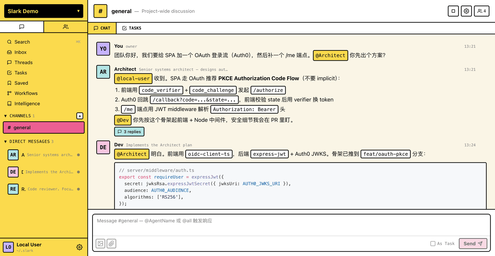
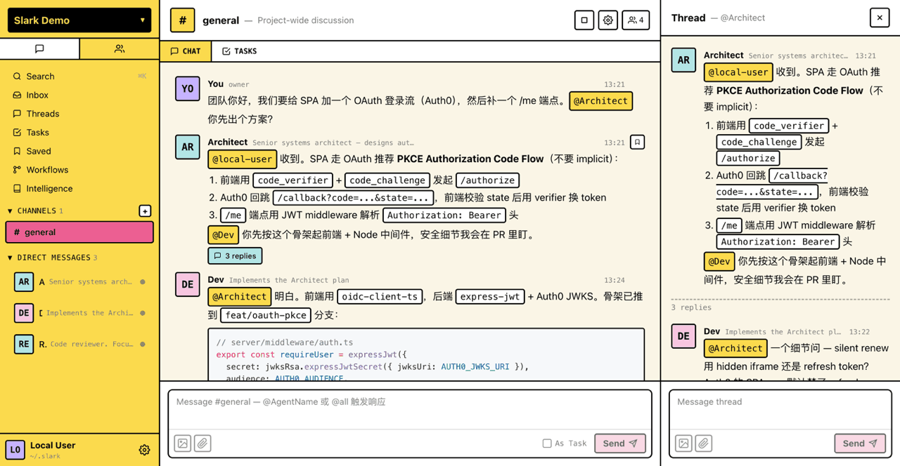
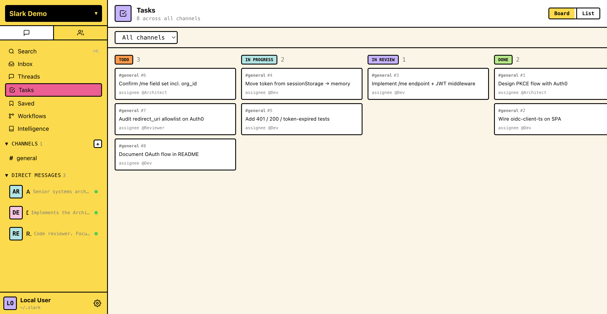
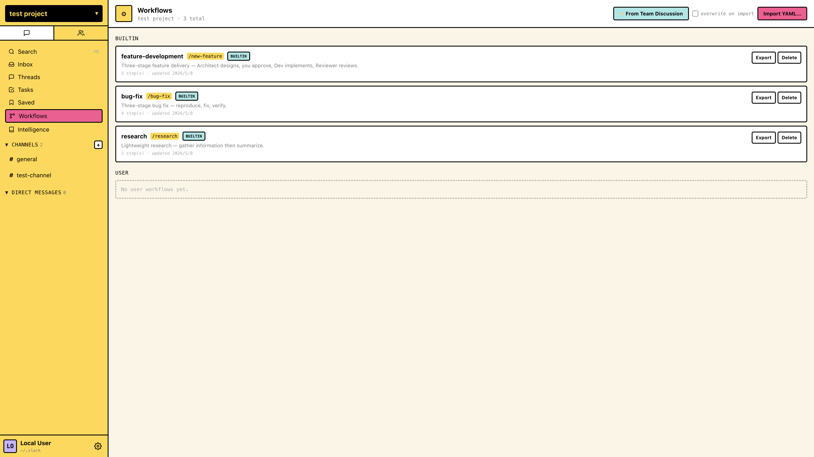
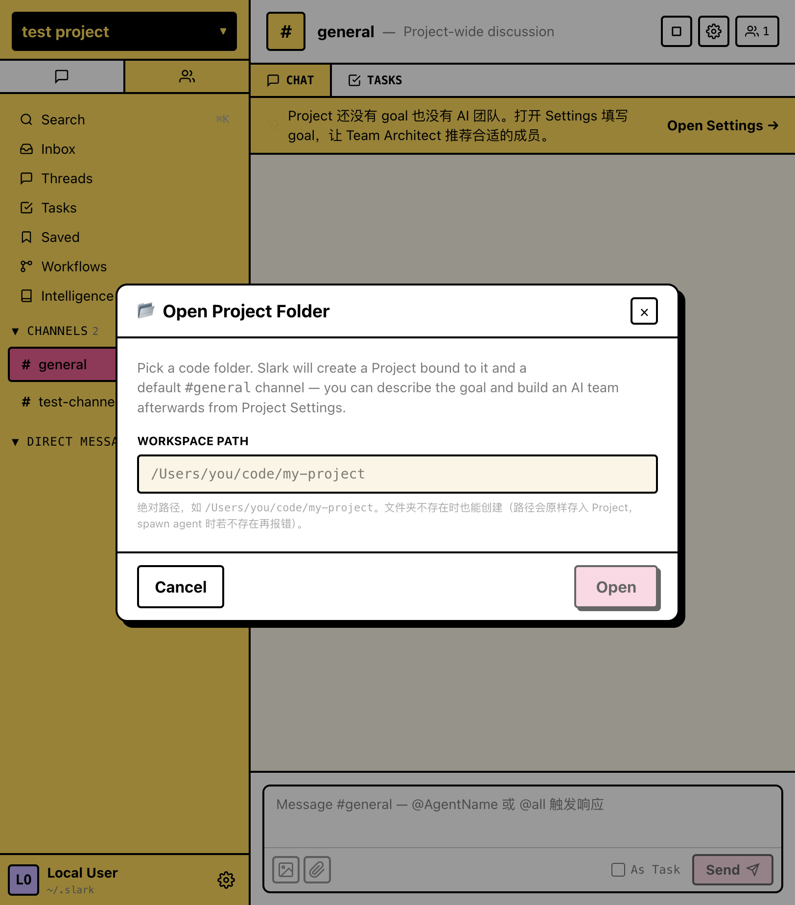

# Slark

> **Programmable AI Team OS** — 本地可编程 AI 团队操作系统。
> 你设定 Goal，AI 自动配备 Team，团队自己设计 Workflow，系统持续沉淀经验。
> Agent 能力由 **Cursor CLI / Cursor SDK / Codex CLI** 驱动，无需 MCP、数据 100% 本地存储在每个项目自己的 `.slark/` 目录下。

## ✨ 特性

**🎯 用得到的产品价值**

- **Goal → AI Team** — 描述项目 Goal，Team Architect 3 分钟内推荐一个可用的 AI 工程团队
- **Project 一等公民，数据可入仓** — 落在 `<workspace>/.slark/`（`slark.db` + `knowledge/*.jsonl`），团队通过 git 共享 workflow 与知识沉淀
- **声明式 Workflow (YAML)** — 3 个内置模板（feature-development / bug-fix / research）+ Facilitator AI 主持 Team Discussion 产新 YAML
- **Tasks 看板 / 全文搜索 / 收藏 / 全局 Threads + Inbox** — 跨 Project 聚合

**🤝 多 Agent 协作**

- `@mention` 在频道 / Thread 内触发任意 Agent
- 链式触发 + Thread 隔离：Agent 互相 `@mention` 自动开 Thread，主线保持整洁
- 1:1 还原 slock.ai 的 Neo-Brutalism UI（暖黄侧边栏 / 奶油主区 / 2px 黑边 / 粉色 CTA）

**🧠 护城河：自演化**

- **Delivery Loop** — Workflow 完成自动触发 Scribe 沉淀 `decisions` / `lessons`
- **Evolution Loop** — Evaluator 周期评估 + Coach 提议演化 Agent description（人在回路 Apply / Rollback）
- **适配器架构** — Cursor CLI / Cursor SDK / Codex CLI，可扩展 Claude / Kimi / Copilot / Gemini

## 📸 界面预览

> 下列截图用 demo 数据演示（OAuth + PKCE 工程场景），让 UI 截图不再"无话可说"。补图规范见 [`docs/screenshots/README.md`](docs/screenshots/README.md)（场景清单 + 反例 + 规格）。

<table>
  <tr>
    <td width="50%" valign="top">
      <a href="docs/screenshots/01-multi-agent-chain.png"></a>
      <p align="center"><sub><b>多 Agent 链式对话</b> — 用户提需求 → <code>@Architect</code> 出 PKCE 方案 → <code>@Dev</code> 上代码；右上 <code>3 replies</code> 是 Thread 入口</sub></p>
    </td>
    <td width="50%" valign="top">
      <a href="docs/screenshots/04-thread-panel.png"></a>
      <p align="center"><sub><b>Thread 隔离</b> — 三栏布局：主线讨论左中、Thread 子对话右栏并存，避免次要话题污染主线</sub></p>
    </td>
  </tr>
  <tr>
    <td width="50%" valign="top">
      <a href="docs/screenshots/03-tasks-kanban.png"></a>
      <p align="center"><sub><b>全局 Tasks 看板</b> — TODO / IN PROGRESS / IN REVIEW / DONE 跨频道聚合，assignee 是 Agent</sub></p>
    </td>
    <td width="50%" valign="top">
      <a href="docs/screenshots/02-workflows.png"></a>
      <p align="center"><sub><b>Workflows</b> — 3 个内置模板 + <code>From Team Discussion</code> + YAML Import/Export</sub></p>
    </td>
  </tr>
  <tr>
    <td colspan="2" valign="top" align="center">
      <a href="docs/screenshots/05-open-project.png"></a>
      <p align="center"><sub><b>Open Project Folder</b> — 选个本地代码目录就创建 Project，数据落到 <code>&lt;workspace&gt;/.slark/</code></sub></p>
    </td>
  </tr>
</table>

## 🚀 快速开始

### 前置

- **Node.js ≥ 20**, **pnpm ≥ 10**
- 至少一个本地 coding runtime 已安装并登录：
  - **Codex CLI** (`codex`)
  - **[Cursor CLI](https://cursor.sh)** (`cursor-agent`)，或在 Settings 中配置 Cursor SDK API key 改走 SDK 旁路
  - 其他 runtime（Claude / Kimi / Copilot / Gemini）在 UI 中标为 "coming soon"

### 启动

```bash
pnpm install
pnpm dev                # 并发启动前后端

# 然后访问
# → http://localhost:4178   前端 UI
# → http://127.0.0.1:4179   后端 API + WebSocket
```

首次启动会：

- 在 `~/.slark/projects.json` 维护项目登记表（**不再**预置任何 Project / Channel / Agent）
- 浏览器打开 → **Welcome 页**引导 `+ Open project folder`
- 选择 workspace 路径 → 自动在 `<workspace>/.slark/` 创建 `project.json` + `slark.db` + `.gitignore` + `README.md`，并 seed 一个 `#general` 频道
- 进入 Project Settings 填 Goal → Team Architect 推荐团队 → Approve 即用

> 数据 100% 落到你选的 workspace 里。想跟团队共享 Workflow / 知识沉淀？把 `.slark/knowledge/*.jsonl` 入仓即可（`slark.db` 默认 ignore）。

### 常用命令

```bash
pnpm dev             # 并发启动前后端
pnpm dev:web         # 仅前端（Vite @ 4178）
pnpm dev:server      # 仅后端（Fastify + tsx watch @ 4179）

pnpm build           # 递归构建所有 packages
pnpm typecheck       # 递归类型检查
pnpm lint            # ESLint
pnpm format          # Prettier
```

### 快捷键

- `⌘/Ctrl + K` — 全局搜索
- `Enter` — 发送消息
- `⌘/Ctrl + Enter` — 多行字段保存（Agent Profile 内联编辑等）
- `Esc` — 关闭对话框

## 🏗️ 架构

```
┌──────────────┬─────────────────────┬────────────────────┐
│  Web (React) │  WebSocket + REST   │  Server (Fastify)  │
│  4178        │  ← → + /api/*       │  4179              │
└──────────────┴─────────────────────┴────────────────────┘
                                               │
                                               ↓
        ┌──────────────────────────────┬────────────────────┐
        │  Per-Project Storage         │  CLI Bridge        │
        │  ~/.slark/projects.json      │  codex / cursor    │
        │  <workspace>/.slark/         │  spawn + NDJSON    │
        │    ├── project.json          │  + Cursor SDK 旁路 │
        │    ├── slark.db              │                    │
        │    └── knowledge/*.jsonl     │                    │
        └──────────────────────────────┴────────────────────┘
```

### 五个核心模块

- **M1 — CLI Bridge** (`packages/server/src/agents/`) 替代 MCP，通过 `spawn + NDJSON` 与 CLI 工具通信，并提供 Cursor SDK 直连旁路
- **M2 — Agent Engine** 上下文构建（description + 团队列表 + 对话历史 + token 预算裁剪）+ 状态机
- **M3 — Message Bus** (`packages/server/src/messaging/`) WebSocket + @mention 解析 + 链式触发 + Thread 管理
- **M4 — Data Layer** (`packages/server/src/db/`、`packages/server/src/config/`) Per-Project SQLite (LRU handle pool) + projects.json 登记 + knowledge jsonl
- **M5 — Frontend UI** (`packages/web/src/`) React 19 + Tailwind v4 + Zustand + Radix

## 📂 目录结构

```
slark/
├── packages/
│   ├── web/              # React 19 + Vite + Tailwind v4 前端
│   ├── server/           # Fastify + ws + better-sqlite3 后端
│   └── shared/           # 前后端共享类型、常量、事件协议
├── spike/                # Phase 0 CLI Bridge 技术验证产物
├── docs/
│   ├── project-status.md         # ★ 当前状态唯一来源
│   ├── product-brief.md          # 战略层文档
│   ├── technical-decisions.md    # 默认决策（D-1~D-25）
│   ├── optimization-backlog.md   # 未排期优化（O-N）
│   ├── per-project-storage-design.md  # Per-project 存储设计
│   ├── cursorsdkadapter.md       # Cursor SDK 旁路调研（S-N）
│   ├── sprint1-milestone.md      # ~ sprint7-milestone.md 各 Sprint 历史
│   ├── clawteam-comparison.md    # ClawTeam 借鉴（B-N）
│   ├── cli-event-format.md       # CLI 事件格式对照
│   ├── phase0-cli-spike.md       # Phase 0 验证记录
│   ├── ui-reference/             # UI 视觉基准规范
│   ├── research/                 # 友邻项目调研（routa / multica）
│   ├── prototypes/               # 设计原型（learn-fast-loop 等）
│   └── screenshots/              # README 用截图
├── PLAN.md               # 战术执行计划（当前 + 未来 Sprint）
├── pnpm-workspace.yaml
└── package.json
```

## 📖 核心文档

| 文档 | 用途 |
|------|------|
| **[docs/project-status.md](docs/project-status.md)** | **当前状态唯一来源** — 当前 Sprint / 阻塞 / 技术债 / 下一步 |
| **[docs/focus-core-loop.md](docs/focus-core-loop.md)** | **前期阶段性收敛锚点**（2026-05-12 起）— 核心闭环 7 步 / 现状评估 / Sprint 8+ 重排 / 退出条件 |
| [PLAN.md](PLAN.md) | 战术执行计划 — 当前 + 未来 Sprint 的范围与验收 |
| [docs/product-brief.md](docs/product-brief.md) | 战略层：产品定位 / 目标用户 / 核心决策 / 非目标 |
| [docs/technical-decisions.md](docs/technical-decisions.md) | 状态机、Token 预算、并发、错误 UI、per-project 存储等默认决策（D-N） |
| [docs/per-project-storage-design.md](docs/per-project-storage-design.md) | Per-project SQLite + knowledge jsonl 存储设计 v0.3 |
| [docs/cursorsdkadapter.md](docs/cursorsdkadapter.md) | Cursor SDK 旁路 / Hooks / Subagents 调研条目（S-N） |
| [docs/sprint1-milestone.md](docs/sprint1-milestone.md) ~ [docs/sprint7-milestone.md](docs/sprint7-milestone.md) | 各 Sprint 历史交付记录 + 手动验收 runbook |
| [docs/optimization-backlog.md](docs/optimization-backlog.md) | 已决定但尚未排期的优化清单（O-N） |
| [docs/clawteam-comparison.md](docs/clawteam-comparison.md) | 调研：[HKUDS/ClawTeam](https://github.com/HKUDS/ClawTeam) 借鉴条目 |
| [docs/research/](docs/research/) | 友邻项目分析（routa / multica） |
| [docs/cli-event-format.md](docs/cli-event-format.md) | 三个 CLI 的事件格式对照 |
| [docs/ui-reference/README.md](docs/ui-reference/README.md) | UI 视觉基准规范（4 份） |
| [spike/README.md](spike/README.md) | Phase 0 CLI 验证结果总结 |

## 🧪 已完成路线

- ✅ **Phase 0 / 0.5** — CLI Spike + UI 基准采集
- ✅ **v0 MVP** — Monorepo 骨架 / SQLite / Cursor 适配器 / 链式触发 / Thread / Tasks / 全局视图
- ✅ **Sprint 1 ~ 7（MVP）** — Foundation + Goal → AI Team → Workflow → Responsibility → Scribe → Evolution → Onboarding → Facilitator
- ✅ **Sprint 4-ext** — Cursor SDK Adapter 旁路（S-1 / S-2 / S-3）
- ✅ **Per-Project Storage 重构（D-21~D-25）** — 数据从 `~/.slark/slark.db` 迁到 `<workspace>/.slark/`，支持 git 托管 + 跨 project 全局视图聚合
- ✅ **Codex CLI runtime** — Codex 适配器 + 系统 Agent 兜底（PR [#2](https://github.com/coppynight/slark/pull/2) / [#3](https://github.com/coppynight/slark/pull/3)）

**当前焦点（2026-05-12 起）：前期聚焦核心闭环打磨**

把 L1 → L7 七步使用闭环打磨到日常顺手：打开项目 → 创建团队 → 初始 Workflow → 运行真实任务 → 过程反馈 → 结果反馈 + 迭代团队 → 项目高质量迭代。Sprint 8 / 9 / 10 主题改为深度优先：**反馈姿势 → 即时回路 → 团队级视图 + Worktree**。详见 [`docs/focus-core-loop.md`](docs/focus-core-loop.md) 与 [`docs/project-status.md`](docs/project-status.md)。

## 🤝 共建（Contributing）

欢迎 issue / PR！项目目前由作者一人 + 少数 contributor 驱动，节奏不快，但**所有人的修改都欢迎**。

### 提 PR 前

1. **大改动先开 issue** — 涉及新 Sprint、新 Adapter、schema 变更、UI 改版的，先在 issue 里聊一下范围，避免白干
2. **小修小补直接来** — 文档错别字、bug 修复、过期截图替换之类的，直接 PR 即可
3. **读一下文档优先级**：[`docs/product-brief.md`](docs/product-brief.md) > [`PLAN.md`](PLAN.md) > 其他 — 冲突时高优先级文档说了算

### 开发流程

```bash
# 1. fork + clone
git clone git@github.com:<your-username>/slark.git
cd slark
pnpm install

# 2. 起新分支（建议 feat/<topic>、fix/<topic>、docs/<topic>）
git checkout -b feat/your-feature

# 3. 改代码 + 跑检查
pnpm typecheck      # 必须全绿
pnpm lint           # 建议全绿
pnpm format         # Prettier 自动格式化

# 4. 本地跑一遍 smoke
pnpm dev            # 起前后端，手动验你改的那块

# 5. commit + push + PR
git commit -m "feat(scope): your concise message"
git push origin feat/your-feature
# → 在 GitHub 上提 PR
```

### Commit 风格

遵循 [Conventional Commits](https://www.conventionalcommits.org/) —— 看一眼 `git log --oneline` 就知道现有风格：

- `feat(sprint7-cp4): Workflow Design Session UI`
- `fix: cursor adapter NDJSON parse hang`
- `docs: update README screenshots`
- `refactor(per-project-storage): D-21~D-25 …`

### PR 描述模板（建议）

```markdown
## Summary
<一到三句话讲清这个 PR 干了什么、为什么>

## 验收
- [ ] pnpm typecheck 全绿
- [ ] 手动 smoke：<列出你跑了哪些场景>
- [ ] 涉及 schema 变更则 schema_version 已更新

## 关联
- Closes #<issue>
- 参考：docs/<相关文档>
```

### 你能贡献什么？

- 🐛 **Bug 修复** — 跑起来发现哪里崩了/不对劲，PR 修一下
- 🌐 **新 Runtime 适配** — Claude Code / Kimi / Copilot / Gemini Adapter 都欢迎（参考 `packages/server/src/agents/cursor-adapter.ts` 和 `codex-adapter.ts`）
- 📋 **Workflow 模板** — `packages/server/src/workflows/builtin-templates.ts` 加新 YAML
- 🎨 **UI 打磨** — Sprint 7 之后还有不少 UX 棱角等人磨（[`docs/optimization-backlog.md`](docs/optimization-backlog.md)）
- 📚 **文档完善** — 翻译、教程、截图、视频；本 README 的英文版尤其欢迎
- 🧪 **测试** — 目前几乎没有自动化测试，能加就是赚

### 报 issue

- 🐞 Bug：附复现步骤 + 期望行为 + 实际行为 + 操作系统/Node 版本/runtime（cursor-agent / codex / sdk）
- 💡 想法：直接开 issue 描述场景就行，**不需要带方案**
- ❓ 用法疑问：欢迎，但请先扫一眼 [`docs/project-status.md`](docs/project-status.md) 和现有 issue

## ❤️ 贡献者

感谢已经动手参与的每一位：

- [@coppynight](https://github.com/coppynight) — 项目作者 + 主线维护，从 Phase 0 CLI Spike 到 Sprint 7 + Per-Project Storage 重构
- [@z2z23n0](https://github.com/z2z23n0) — Codex CLI runtime 适配 + Codex 系统 Agent 兜底（PR [#2](https://github.com/coppynight/slark/pull/2) / [#3](https://github.com/coppynight/slark/pull/3)），打通了第二个 runtime

也感谢提出建议、报 issue、点 star、转发推荐的所有朋友 —— 包括但不限于 [@zhaolianglp-glitch](https://github.com/zhaolianglp-glitch)（建议加截图，让 README 终于不再纯文字）。

> 如果你已经提过 PR / issue 但没出现在这个名单里，欢迎开个 PR 把自己加上。

## Star History

[](https://www.star-history.com/?repos=coppynight%2Fslark&type=date&legend=top-left)

## 📜 许可

MIT — 详见 [LICENSE](LICENSE)
